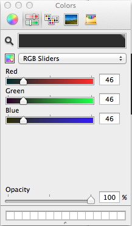
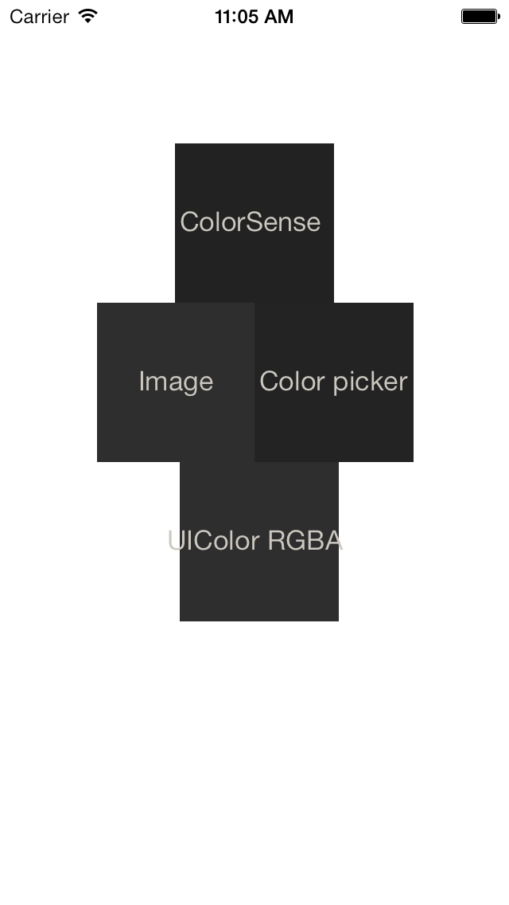

##XCode自带Color Picker 取值偏差


```objc
// 46.0f/255.0f = 0.18039215686274509803
[_colorImageView setBackgroundColor:[UIColor colorWithWhite:46.0f/255.0f alpha:1]];
// 0.135 
[_colorSenseImageView setBackgroundColor:[UIColor colorWithWhite:0.135 alpha:1.000]];
```

1、Color picker 为Xcode取色器取的色值，46，46，46，1 没有偏差。  



2、[ColorSense](https://github.com/omz/ColorSense-for-Xcode) 用的是xcode的插件调用的也是系统取色器，取值是0.135。

```objc
// 0.135 
[_colorSenseImageView setBackgroundColor:[UIColor colorWithWhite:0.135 alpha:1.000]];
```

3、Image 设置的图片

4、UIColor RGBA 代码设置的颜色, 46.0f/255.0f = 0.18039215686274509803 取值和0.135有偏差

```objc
// 46.0f/255.0f = 0.18039215686274509803
[_colorImageView setBackgroundColor:[UIColor colorWithWhite:46.0f/255.0f alpha:1]];
```

具体模拟器上效果图


最后在效果图上取色，1和2的RGB 为 35，35，35， 3和4的RGB 为 46，46，46